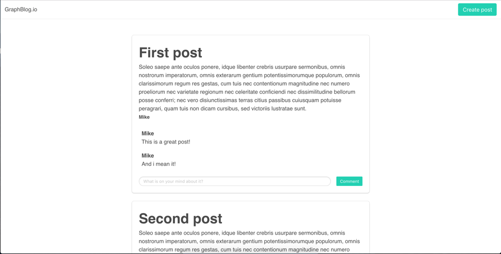

# GraphQL Workshop for Best Of Web


## Introduction

Ce workshop préparé au sein de [JS-Republic](http://js-republic.com/) par [Michael Romain](http://twitter.com/michaeldotjs) et [Mathieu Breton](https://twitter.com/matbreton) a pour but de vous apprendre à utiliser [GraphQL](https://graphql.org/).

D'une durée approximative de 3h, ce workshop vous guide pas à pas dans la migration d'un CMS basique fait avec une API Rest vers une implémentation full GraphQL. Chaque étape vous démontrera les avantages (et inconvénients) de GraphQL comparé à Rest pour les mêmes besoins. Ce workshop est conçu pour des développeurs JavaScript, débutant avant GraphQL.

## Pré-requis

Pour suivre ce workshop, vous aurez besoin :

* De connaissances confirmées dans le langage [JavaScript](https://developer.mozilla.org/fr/docs/Web/JavaScript), en [NodeJS](https://nodejs.org/en/) et en développement Front-End.
* D'une prémière expérience avec les [API Rest](https://openclassrooms.com/courses/utilisez-des-api-rest-dans-vos-projets-web).
* De [NodeJS](https://nodejs.org/en/) installé en version **6.14.2 et plus**. Dans un soucis de compatibilité, l'implémentation back-end fonctionne avec la version 6.\* de Node, version la plus vielle actuellement encore maintenue. Si vous utilisez [nvm](https://github.com/creationix/nvm), vous pouvez faire un `nvm use` à la racine du projet pour passer directement dans la bonne version de NodeJS.
* D'un éditeur de code. [Visual Studio Code](https://code.visualstudio.com/) fait désormais référence.

## Installation

Une fois n'est pas coutume, nous récupérons ce projet depuis Github et installerons ses dépendances :

```bash
git clone ...
cd graphql-workshop
npm install
```

Il ne reste plus qu'à le démarrer :

```bash
npm start
```

Ouvrez votre navigateur à l'adresse <http://localhost:3000>, vous devriez découvrir cette interface :



## Premier exercice
